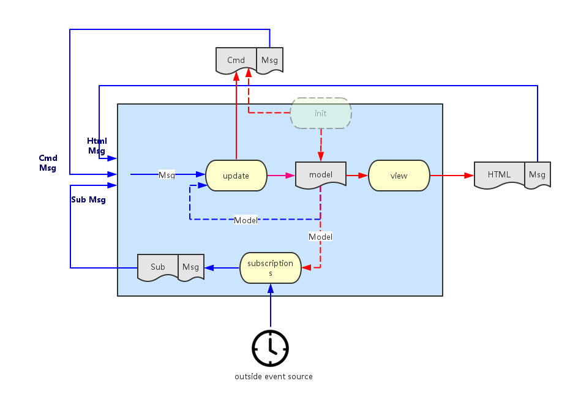

# Vanilla Javascript "The Elm Architecture" TODO

This is the simplest possible implementation gathered from multiple resources.

It avoids the cumbersomeness of using functional programming while being easier to reason about and having the same benefits.

The only dependency is a Virtual-DOM, essential for the rendering process.

```bash
npm i virtual-dom --save
```

